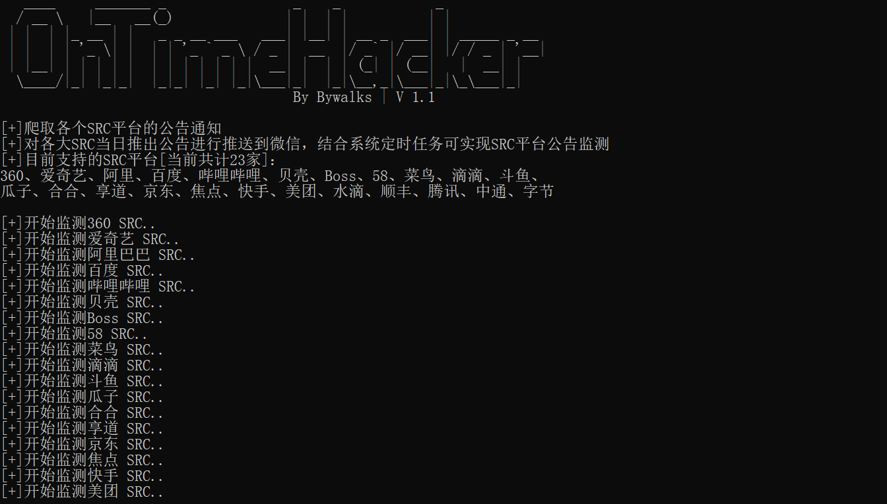
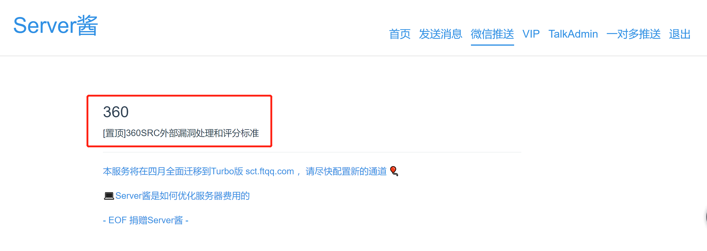

# OnTimeHacker V1.1 #

**OnTimeHacker** 是一个爬取各大SRC当日公告，并通过微信通知的小工具

OnTimeHacker目前版本为1.1，已支持23家SRC
```
V 1.0 已支持SRC：
360、爱奇艺、阿里、百度、哔哩哔哩、贝壳、Boss、58、菜鸟、滴滴、斗鱼、
瓜子、合合、享道、京东、焦点、快手、美团、水滴、顺丰、腾讯、中通、字节

V 1.1 更新日志:
    新增异常处理
    删除原饿了么模块：原饿了么SRC归并到阿里SRC
    更新字节、快手模块接口
```

------

### Install ###

```
python3 -m pip install -r requirements.txt
```

### 开始使用 ###

```
python3 OnTimeHacker.py
```

### 如何实现微信通知？

下载文件后，在代码中添加上你自己的 Server酱 key 就行了， Server酱 key 的申请地址为：[http://sc.ftqq.com/](http://sc.ftqq.com/)

### 如何实现公告监测？

首先在 vps 上下载安装该工具，之后设置定时任务即可。比如我想在每天的上午 9 点获取一下各大 SRC 有没有新的公告：

1、输入`crontab -e`

2、在打开的界面中输入`00 9 * * * python3 /root/OnTimeHacker/OnTimeHacker.py`即可。

### 扫描结果 ###



### 微信消息 ###



### 参考 ###
本想自己写一个这样的工具，查询后发现有小伙伴已经写了个爬取当年公告的，拿小伙伴的代码改一改，使之符合自己的需求，原版[@teamssix](https://github.com/teamssix)
